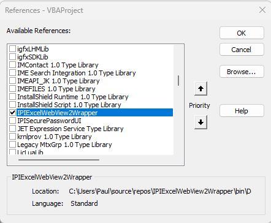
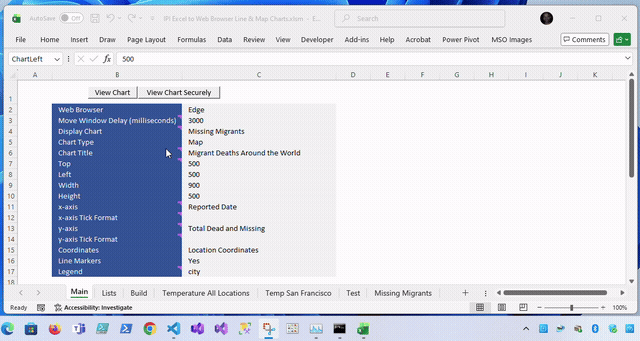

# IPI Excel to Web Browser Line & Map Charts

## References

I combined parts of my course work from the following courses to build the html code, styles and scripts.

[Data Visualization with D3 - Full Course 2018](https://m.youtube.com/watch?v=_8V5o2UHG0E)

[Data Visualization with D3, JavaScript, React - Full Course 2021](https://m.youtube.com/watch?v=2LhoCfjm8R4)

## About

In 26 years of programming and developing Microsoft solutions this project achieves integrating a Microsoft product with modern open source technology. Ms Edge, Internet Explorer and the Microsoft VBA web browser could not offer me the ability to utilise D3 and modern JavaScript in VBA code using a COM model. So, I stopped looking at what they could/couldn't do and utilised Chromes/Ms Edges App function.

## Function

- The Main tab allows the user to choose:
  - The worksheet to generate the chart from.
  - What chart type to run.
  - The title to use in the chart.
  - The positioning of the Chrome/Ms Edge App when loaded.
  - The column names to use in the x-axis, y-axis and Legend.
  - Turn on line markers and format to use if not default.
- The Build tab contains the html content to be used in building the web page output. Although content can be developed using the Build tab, it is easier to use the index.html file.
- The index.html file is used to develop scripts and achieve functions required. Those scripts are then saved to individual files before being copied into a shape object in the build tab.
- The Lists tab provides lists for he dropdown menus in the Main tab.
- All other tabs and any newly created tabs will appear in the Lists tab Data Sheets list. It uses a named range formula to spill the list of sheet names.
- The VBA code:
  - Combines the shape object values of the build tab and the used range of the selected data sheet.
  - Generates a temporary web page file.
  - Calls the Chrome/Ms Edge App function with the file location.
  - Positions the Chrome/Ms Edge App.
  - Then clears the data in the temporary file. If you refresh the Chrome/Ms Edge App page you will get a notification that the data has been cleared and to run the App again from Excel.

## What this means

Excel/VBA now has a way to generate geospacial charts and other web page designs using version 7.6.1 of D3 from <https://d3js.org>.

## Secure API

- With a bit of help from ChatGPT I have added a .Net Framework Win Forms API to ensure all data remains within Excel and nothing is written to any temporary file.
- The API uses Microsofts Edge View SDK to generate a form for viewing the web content.
- You will need to register the COM Object before you can add it in the VBA project.
- To register the API, go to the folder you saved the API folder to and right click the DLL file ExcelWebView2Wrapper.dll and select `Copy as path`. Pre Windows 11, use Shift Left Click to see the menu item.
- Then ***either*** open Command Prompt elevated as Admin and run the following command after pasting in the path copied:

  `"C:\Windows\Microsoft.NET\Framework\v4.0.30319\RegAsm.exe" /codebase /tlb PastePathEntryHere`

- ***Or*** download the RegAsm Toolkit from the following link and register the DLL using it:

  [IPI RegAsm Toolkit](https://github.com/IPI-Paul/IPI-RegAsm-Toolkit)

- Once the ExcelWebView2Wrapper.tlb file is created, follow the steps below to find it an load it into the Excel documents VBA project:

  `VBA Project => Tools => References => Select IPIExcelWebView2Wrapper`

  

- If it is not listed then try the following.

  `VBA Project => Tools => References => Browse => Select IPIExcelWebView2Wrapper.tlb`

- Close the VBA window and save the Excel file.
- Click the `View Chart Securely` button to send the data securely to the API and view the output:

  
